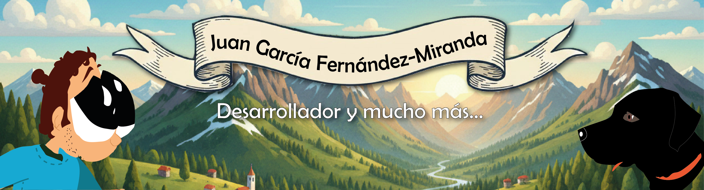

<h1>DATOS PERSONALES</h1>
<h2>Lo que dicen sobre mí</h2>

 **Curioso y Directo:** No me ando con rodeos. Voy al grano y me gusta poner a prueba las capacidades de la tecnología para ver qué puede ofrecerme.  

**Explorador Digital:** Soy tipo de persona que no se conforma con usar las herramientas de forma superficial; buscas una conexión más personalizada y "humana".

**Minimalista en la Comunicación:** Prefiero la eficiencia. Una frase corta y clara suele decir más que un párrafo lleno de adornos.

Soy una mente evaluadora y busco la autenticidad.

---

<h2> Formación académica y complementaria </h2>

· Fp de grado medio de Pre-impresión en Artes Gráficas en I.E.S. Pando.  
· Curso de diseño gráfico. Inem  
· Curso diseño web. Forem  
· Curso edición y montaje de vídeo. Inem  
· Curso de animación 2d. Inem  
· Curso de modelado y animación 3d. Inem  
· Bootcamp Data Analyst 2026, Factoría F5

---

<h2> Experiencia laboral </h2>

**· Imprenta de la Universidad de Oviedo.**  
*(Realización de la maqueta de libros para su impresión) - 2002*  

**· SUMMA.**  
*Prácticas: (Inspección y montaje de trabajos para su correcta impresión) - 2004*  

**· Gráficas Naranco.**  
*(Tareas de diseño, preimpresión, ploteado, manipulador de papel, reparto y otros) - 2005 - 2013*   

**· Imprenta Rino.**  
*(Trabajos de serigrafía, formación en máquinas Roland) - 2017*  

**· Taluan Digital.**  
*(Tareas de diseño, preimpresión, coordinador de montajes, ayudante en producción, serigrafía, trabajos para DTF y otros) - 2023*    

**· SCISE (Industrial serigráfica de Asturias).**  
*(Tareas de diseño, preimpresión, coordinador de montajes, ayudante en producción, serigrafía, trabajos para DTF y otros) - 2025*  

---

<h2> Datos de interés </h2>

· Carnet de conducir y vehículo propio.  
· Idiomas: Español (Nativo) Inglés (alto) Alemán (en aprendizaje).  
· Deportista.  
· Discapacidad física del 62%, que no me impide realizar con normalidad todo tipo de trabajos, y para los cuales no necesito ningún tipo de adaptación.

---

<h2> Software </h2>

Illustrator, Freehand, Indesing, Corel Draw, Photoshop, Premiere, Avid, Effects, Movie Maker, Flash, "Html", QuarqXpress, Office, 3d Maya, Sketchup, VersaStudio, entre otros...

